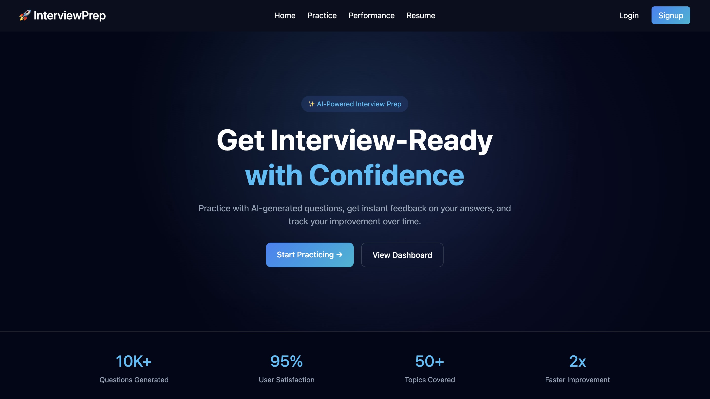
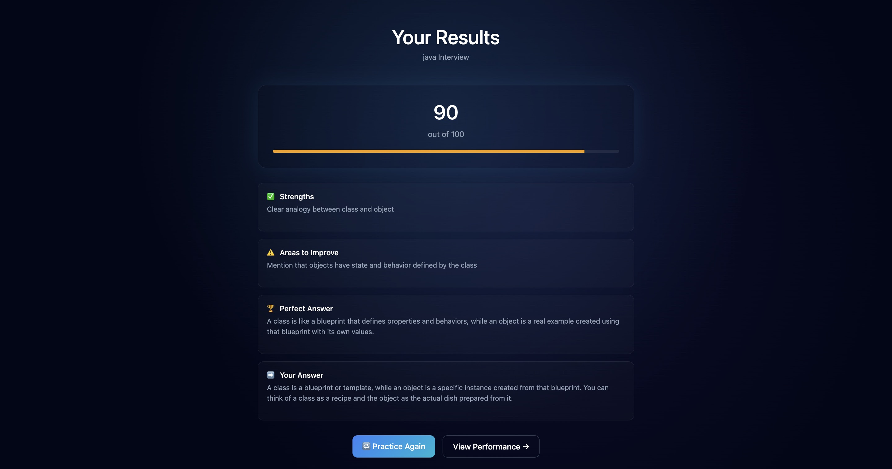
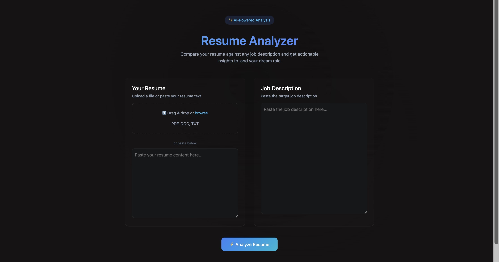
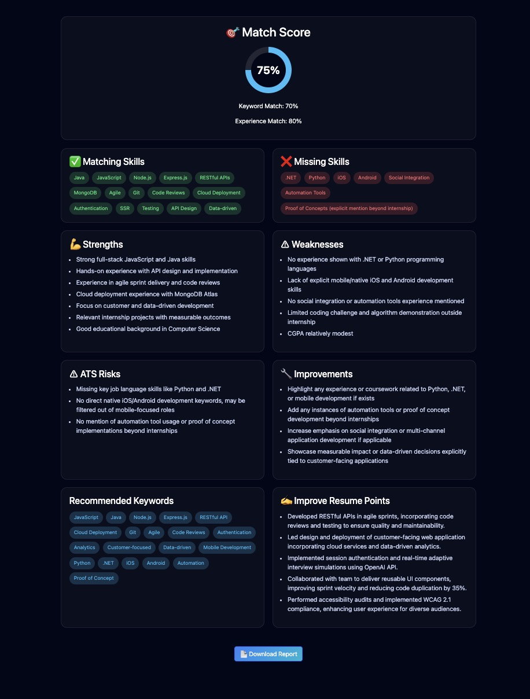

<div align="center">


# 🧠 PrepInsight AI

### _AI-Powered Interview Coaching & Resume Intelligence Platform_

[](https://nodejs.org/)
[](https://expressjs.com/)
[](https://mongodb.com/)
[](https://openai.com/)
[](https://cloudinary.com/)

[](http://makeapullrequest.com)
[](https://github.com/prathammanjul/PrepInsight-AI)
[](https://github.com/prathammanjul)

<br/>

**PrepInsight AI** is a full-stack, production-grade AI SaaS platform that transforms how candidates prepare for job interviews and craft their resumes. Powered by **OpenAI's GPT API**, it delivers real-time, intelligent feedback on interview answers and resume content — offering scoring, gap analysis, and actionable improvement suggestions — all within a seamless, authenticated web experience.

[🚀 Live Demo](https://prepinsight-ai.onrender.com/login)

</div>

---

## 📌 Table of Contents

- [Problem Statement](#-problem-statement)
- [Solution](#-solution)
- [Key Features](#-key-features)
- [Tech Stack](#-tech-stack)
- [Architecture](#-architecture)
- [Folder Structure](#-folder-structure)
- [Screenshots](#-screenshots)
- [Getting Started](#-getting-started)
- [Environment Variables](#-environment-variables)
- [API Workflow](#-api-workflow)
- [Deployment](#-deployment)
- [Future Enhancements](#-future-enhancements)
- [Technical Highlights](#-technical-highlights)
- [Learning Outcomes](#-learning-outcomes)
- [Contributing](#-contributing)
- [Troubleshooting](#-troubleshooting)
- [Author](#-author)
- [License](#-license)

---

## 🎯 Problem Statement

Every year, millions of candidates fail interviews not because of lacking skills — but because of **poor self-presentation**. Traditional interview prep resources are generic, non-personalized, and expensive. Similarly, most job seekers submit resumes with **no objective feedback**, leading to rejections from ATS systems before a human even reads them.

There is a critical gap between a candidate's actual potential and how effectively they can communicate it.

---

## 💡 Solution

**PrepInsight AI** closes that gap. By combining the language understanding capabilities of **OpenAI's GPT models** with a clean, full-stack web interface, the platform provides:

- **Instant, personalized AI feedback** on interview answers — scored, analyzed, and improved
- **Intelligent resume evaluation** — parsing your uploaded PDF and returning structured ATS insights
- **Secure, session-based user accounts** so your history and progress are always saved
- **Downloadable AI-generated reports** in PDF format for offline use

---

## ✨ Key Features

| Feature                           | Description                                                                                                                                     |
| --------------------------------- | ----------------------------------------------------------------------------------------------------------------------------------------------- |
| 🎙️ **Interview Answer Evaluator** | Submit answers to any interview question and receive an AI-generated score, strengths breakdown, weaknesses, and a model improved answer        |
| 📄 **Resume Analyzer**            | Upload your resume as a PDF; the AI extracts, reads, and evaluates it across multiple dimensions (ATS score, keyword density, formatting, gaps) |
| 🤖 **OpenAI GPT Engine**          | Powered by OpenAI's GPT API for high-quality, context-aware language generation and feedback                                                    |
| 🔒 **Usage Limits Per Account**   | Each user gets 5 free interview questions and 2 free resume checks — enforced server-side via middleware, mimicking a real freemium SaaS model  |
| ☁️ **Cloud Resume Storage**       | Resumes are securely uploaded to Cloudinary and parsed on-the-fly using `pdf-parse`                                                             |
| 📥 **PDF Report Export**          | Users can download their AI feedback as a beautifully formatted PDF report using PDFKit                                                         |
| 🔐 **Secure Authentication**      | Full session-based auth with Passport.js (local strategy), bcrypt password hashing, and connect-flash for notifications                         |
| ✅ **Input Validation**           | All user inputs are validated server-side using Joi schemas before any processing                                                               |
| 🧩 **MVC Architecture**           | Clean separation of concerns: Models (Mongoose), Views (EJS), Controllers (Express routes)                                                      |
| 🎨 **Responsive UI**              | Server-side rendered EJS templates with CSS for a fast, accessible interface                                                                    |

---

## 💎 Freemium Usage Model

PrepInsight AI implements a **real-world freemium system** where each registered user gets a limited number of free AI interactions — enforced entirely on the backend, just like production SaaS products.

| Feature                | Free Tier Limit |
| ---------------------- | --------------- |
| 🎙️ Interview Questions | 5 per account   |
| 📄 Resume Analyses     | 2 per account   |

### How it works under the hood

- Every user document in MongoDB tracks two counters: `interviewQuestions` and `resumeChecks`
- Dedicated middleware functions (`checkInterviewLimit`, `checkResumeLimit`) run before every AI request
- If the user has hit their limit, they are redirected with a flash message — the AI is never called, saving API costs
- On each successful AI interaction, the counter is incremented atomically using MongoDB's `$inc` operator
- The remaining count is passed to the EJS view so users always see how many uses they have left

### Why this matters

This pattern directly mirrors how real AI SaaS platforms (like ChatGPT, Jasper, Copy.ai) manage usage quotas. Implementing it from scratch demonstrates understanding of: middleware design, database-driven access control, cost optimization, and user experience design.

---

## 🛠️ Tech Stack

### Backend

| Technology                             | Purpose                                    |
| -------------------------------------- | ------------------------------------------ |
| **Node.js**                            | Runtime environment                        |
| **Express.js v5**                      | Web framework & routing                    |
| **MongoDB + Mongoose**                 | NoSQL database & ODM                       |
| **Passport.js**                        | Authentication middleware (local strategy) |
| **passport-local-mongoose**            | Simplified user model plugin               |
| **express-session**                    | Session management                         |
| **connect-flash**                      | Flash messages for UX notifications        |
| **Joi**                                | Server-side schema validation              |
| **dotenv**                             | Environment variable management            |
| **Multer + multer-storage-cloudinary** | Multipart file upload handling             |

### AI & Cloud Services

| Technology           | Purpose                                                     |
| -------------------- | ----------------------------------------------------------- |
| **OpenAI API (GPT)** | AI engine for feedback, scoring, and improvement generation |
| **Cloudinary**       | Cloud storage for uploaded resume files                     |
| **pdf-parse**        | Extract text from uploaded PDF resumes                      |
| **PDFKit**           | Generate downloadable feedback PDFs                         |

### Frontend

| Technology              | Purpose                                       |
| ----------------------- | --------------------------------------------- |
| **EJS + ejs-mate**      | Server-side templating with layouts           |
| **CSS3**                | Custom styling and responsive design          |
| **Express EJS Layouts** | Shared layout system (header, footer, navbar) |

---

## 🏗️ Architecture

```
┌─────────────────────────────────────────────────────────┐
│                     CLIENT BROWSER                       │
│              (EJS Templates + CSS + JS)                  │
└────────────────────────┬────────────────────────────────┘
                         │ HTTP Request
                         ▼
┌─────────────────────────────────────────────────────────┐
│                   EXPRESS.JS SERVER                      │
│                                                          │
│  ┌─────────────┐  ┌──────────────┐  ┌───────────────┐  │
│  │  Middleware │  │    Router    │  │  Error Handler│  │
│  │  (Auth,     │→ │  (Routes +   │→ │  (Flash Msgs, │  │
│  │  Sessions,  │  │  Controllers)│  │  Validation)  │  │
│  │  Multer,    │  └──────┬───────┘  └───────────────┘  │
│  │  Flash)     │         │                               │
│  └─────────────┘         │                               │
└──────────────────────────┼──────────────────────────────┘
                           │
           ┌───────────────┼───────────────┐
           │               │               │
           ▼               ▼               ▼
   ┌───────────────┐ ┌──────────┐ ┌──────────────────┐
   │   MongoDB     │ │Cloudinary│ │  AI Service       │
   │  (Mongoose)   │ │ (Files)  │ │  ┌─────────────┐  │
   │               │ │          │ │  │   OpenAI    │  │
   │  User Model   │ │  Resume  │ │  │  (GPT API)  │  │
   │  Session Data │ │  Storage │ │  └─────────────┘  │
   │  Answer Logs  │ │          │ │                    │
   └───────────────┘ └──────────┘ └──────────────────┘
```

### Request Lifecycle

```
User Request → Session/Auth Middleware → Route Handler
    → Validation (Joi) → Controller Logic
    → AI Service (OpenAI GPT) → Database (MongoDB)
    → Cloudinary (if file) → EJS View Render → Response
```

---

## 📁 Folder Structure

```
PrepInsight-AI/
│
├── 📁 init/                    # Database seed / initialization scripts
│   └── data.js                 # Initial data setup (e.g., sample questions)
│
├── 📁 models/                  # Mongoose data models (MVC - Model layer)
│   ├── user.js                 # User schema with passport-local-mongoose plugin
│   └── ...                     # Additional models (answers, resumes, etc.)
│
├── 📁 public/                  # Static assets served to the client
│   ├── css/                    # Custom stylesheets
│   └── js/                     # Client-side JavaScript (if any)
│
├── 📁 utils/                   # Utility/helper functions
│   └── aiHelper.js             # AI API call wrappers (Gemini & OpenAI)
│   └── pdfHelper.js            # PDF parsing and generation utilities
│
├── 📁 views/                   # EJS templates (MVC - View layer)
│   ├── layouts/                # Shared layout files (ejs-mate)
│   │   └── boilerplate.ejs     # Base HTML layout
│   ├── partials/               # Reusable UI components (navbar, footer)
│   ├── auth/                   # Login, register pages
│   ├── interview/              # Interview prep pages
│   └── resume/                 # Resume upload & results pages
│
├── app.js                      # Main Express application entry point
├── middlewares.js              # Custom middleware (isLoggedIn, validation, etc.)
├── schema.js                   # Joi validation schemas
├── gemini-test.js              # OpenAI API integration test/sandbox script
├── package.json                # Project metadata and dependencies
├── .npmrc                      # npm configuration
├── .gitignore                  # Git ignore rules
└── .env                        # Environment variables (NOT committed)
```

---

## 📸 Screenshots

>

<div align="center">

|         Landing / Home Page          |                Interview Evaluator                 |
| :----------------------------------: | :------------------------------------------------: |
|  |  |

|                  Resume Analyzer                   |                AI Feedback Report                 |
| :------------------------------------------------: | :-----------------------------------------------: |
|  |  |

</div>

>

---

## 🚀 Getting Started

### Prerequisites

Make sure you have the following installed on your system:

- [Node.js](https://nodejs.org/) `v18+`
- [npm](https://npmjs.com/) `v9+`
- [MongoDB](https://mongodb.com/) (local) or a [MongoDB Atlas](https://www.mongodb.com/atlas) URI
- An [OpenAI](https://platform.openai.com/) API key
- A [Cloudinary](https://cloudinary.com/) account

### Installation

**1. Clone the repository**

```bash
git clone https://github.com/prathammanjul/PrepInsight-AI.git
cd PrepInsight-AI
```

**2. Install dependencies**

```bash
npm install
```

**3. Configure environment variables**

```bash
cp .env.example .env
# Then fill in your values (see Environment Variables section below)
```

**4. (Optional) Seed the database**

```bash
node init/data.js
```

**5. Start the development server**

```bash
npm run dev
```

**6. Open in your browser**

```
http://localhost:3000
```

---

## 🔐 Environment Variables

Create a `.env` file in the root directory with the following variables:

```env
# ─── Server ───────────────────────────────────────────────
PORT=3000
NODE_ENV=development

# ─── Database ─────────────────────────────────────────────
MONGO_URI=mongodb://localhost:27017/prepinsight
# OR for MongoDB Atlas:
# MONGO_URI=mongodb+srv://<username>:<password>@cluster.mongodb.net/prepinsight

# ─── Session ──────────────────────────────────────────────
SESSION_SECRET=your_super_secure_session_secret_here

# ─── AI Services ──────────────────────────────────────────
OPENAI_API_KEY=your_openai_api_key_here

# ─── Cloudinary ───────────────────────────────────────────
CLOUDINARY_CLOUD_NAME=your_cloud_name
CLOUDINARY_API_KEY=your_cloudinary_api_key
CLOUDINARY_API_SECRET=your_cloudinary_api_secret
```

> ⚠️ **Security Warning:** Never commit your `.env` file. It is already listed in `.gitignore`. Use environment variable management tools like [dotenv-vault](https://dotenv.org/) or your hosting provider's secrets manager in production.

---

## 🔄 API Workflow

### Interview Answer Evaluation Flow

```
1. User submits: { question, answer }
          │
          ▼
2. Joi validates input → reject if invalid
          │
          ▼
3. isLoggedIn middleware → redirect if unauthenticated
          │
          ▼
4. Controller sends structured prompt to OpenAI (GPT):
   - Interview question context
   - User's answer
   - Request: score (0-100), strengths, weaknesses, improved answer
          │
          ▼
5. AI returns structured JSON response
          │
          ▼
6. Response stored in MongoDB (linked to user session)
          │
          ▼
7. EJS view renders: score card, feedback panels, model answer
          │
          ▼
8. (Optional) User downloads PDF report via PDFKit
```

### Resume Evaluation Flow

```
1. User uploads PDF resume via multipart form
          │
          ▼
2. Multer processes file → multer-storage-cloudinary saves to cloud
          │
          ▼
3. Cloudinary URL + buffer passed to pdf-parse
   → Extracts raw text from PDF
          │
          ▼
4. Extracted text sent to OpenAI (GPT) with analysis prompt:
   - ATS compatibility score
   - Missing keywords
   - Formatting suggestions
   - Section-by-section analysis
   - Actionable improvement steps
          │
          ▼
5. AI returns structured feedback
          │
          ▼
6. Results rendered on EJS results page
7. (Optional) Downloadable PDF feedback report
```

---

## 🔮 Future Enhancements

### AI Enhancements

- [ ] 🧠 **Real-time Interview Simulation** — Conversational AI mock interviews with follow-up questions
- [ ] 🎙️ **Voice-to-Text Answer Submission** — Speech recognition for hands-free practice
- [ ] 📊 **Progress Tracking Dashboard** — Track score improvements over time with charts
- [ ] 🎯 **Role-Specific Question Banks** — AI-curated questions for SDE, PM, Data Science, etc.
- [ ] 🌍 **Multi-language Support** — Support non-English resume/interview evaluation

### Platform Features

- [ ] 🔗 **LinkedIn Profile Integration** — Pull profile data directly for resume analysis
- [ ] 👥 **Peer Review Mode** — Let users review and rate each other's answers
- [ ] 📅 **Interview Scheduler** — Calendar integration for mock interview bookings
- [ ] 🏆 **Leaderboard & Gamification** — Score streaks, badges, and competitive rankings
- [ ] 📧 **Email Digest** — Weekly progress reports delivered to inbox

### Security & Scalability

- [ ] 🛡️ **OAuth 2.0** — Google and GitHub social login
- [ ] 🔑 **JWT + Refresh Tokens** — Stateless auth for API-first architecture
- [ ] ⚡ **Redis Caching** — Cache frequent AI responses to reduce API costs
- [ ] 🚦 **Rate Limiting** — Per-user request throttling to prevent API abuse
- [ ] 📈 **Horizontal Scaling** — Microservices split (auth service, AI service, resume service)

---

## 🔬 Technical Highlights

- **OpenAI GPT Integration** — Structured prompt engineering ensures consistent, parseable JSON responses from the GPT API for scoring, feedback, and improvement generation
- **Freemium Middleware Guards** — `checkInterviewLimit` and `checkResumeLimit` intercept requests before any AI call is made, enforcing per-user quotas tracked in MongoDB via atomic `$inc` updates — eliminating unnecessary API spend
- **Cloud-Native File Handling** — Resumes are streamed directly to Cloudinary via Multer without touching the local filesystem, making the app stateless and container-ready
- **Schema-First Validation** — All API inputs are validated with Joi schemas before any business logic executes, preventing malformed data from ever reaching the database
- **Pluggable Authentication** — `passport-local-mongoose` abstracts salt, hash, and serialize logic into the Mongoose model, keeping auth code minimal and secure
- **MVC Pattern** — Clean separation ensures the codebase is testable, maintainable, and scalable independently across layers
- **EJS Layout System** — `ejs-mate` enables shared layouts, reducing HTML duplication and making global UI changes (navbar, footer) a single-file update

---

## 📚 Learning Outcomes

Building PrepInsight AI provides hands-on experience with:

- Integrating the **OpenAI GPT API** and crafting structured prompts for reliable, parseable LLM responses
- Implementing **session-based authentication** from scratch using Passport.js
- Handling **multipart file uploads** and connecting them to cloud storage (Cloudinary)
- **Parsing and processing PDF documents** programmatically with `pdf-parse`
- Building **production-ready Express applications** with proper middleware architecture
- Designing **Joi validation schemas** for robust server-side input sanitization
- Crafting effective **AI prompts** for structured, parseable LLM responses
- Generating **dynamic PDF documents** server-side with PDFKit

---

## 🛡️ Security Considerations

- 🔐 Passwords are **never stored in plaintext** — `passport-local-mongoose` handles bcrypt hashing automatically
- 🚫 `.env` file is excluded via `.gitignore` — no secrets are ever committed to version control
- ✅ **Joi validation** ensures all user input is sanitized before database operations or AI calls
- 🔒 **Session secrets** are externalized to environment variables and should be cryptographically random strings (32+ characters)
- 🛡️ Express sessions use `httpOnly` cookies by default, protecting against XSS token theft
- ⚠️ **Planned:** Add `helmet.js` for HTTP security headers and `express-rate-limit` for DDoS protection

---

## 🤝 Contributing

Contributions make the open-source community thrive. Any contribution you make is **greatly appreciated**. ❤️

### How to Contribute

1. **Fork** the repository
2. **Create** your feature branch:
   ```bash
   git checkout -b feature/AmazingFeature
   ```
3. **Commit** your changes with a meaningful message:
   ```bash
   git commit -m "feat: add voice-to-text answer submission"
   ```
4. **Push** to your branch:
   ```bash
   git push origin feature/AmazingFeature
   ```
5. **Open a Pull Request** and describe your changes clearly

### Contribution Guidelines

- Follow the existing code style and file structure
- Write meaningful commit messages (follow [Conventional Commits](https://www.conventionalcommits.org/))
- Test your changes locally before submitting a PR
- One PR per feature — keep changes focused and atomic
- Update documentation if you change behavior

### Reporting Issues

Open an issue with the label `bug`, `enhancement`, or `question`. Include:

- Steps to reproduce (for bugs)
- Expected vs actual behavior
- Your Node.js and npm version

---

## 🔧 Troubleshooting

**❌ `MongoServerError: connect ECONNREFUSED`**

> MongoDB is not running. Start it with `mongod` (local) or verify your Atlas connection string in `.env`.

**❌ `Error: GEMINI_API_KEY is not defined`**

> Your `.env` file is missing or not loaded. Ensure `dotenv` is initialized at the very top of `app.js` with `require('dotenv').config()`.

**❌ `MulterError: Unexpected field`**

> The form field name in your EJS template must match the field name in your `upload.single('fieldName')` Multer config.

**❌ `pdf-parse: could not extract text`**

> The uploaded PDF may be image-based (scanned). `pdf-parse` only works on text-layer PDFs. Advise users to upload text-selectable PDFs.

**❌ Port 3000 already in use**

> Another process is using port 3000. Change the port in `.env` (`PORT=3001`) or kill the conflicting process:
>
> ```bash
> # macOS/Linux
> lsof -ti:3000 | xargs kill -9
> ```

**❌ Cloudinary upload fails**

> Double-check `CLOUDINARY_CLOUD_NAME`, `CLOUDINARY_API_KEY`, and `CLOUDINARY_API_SECRET` are correct in `.env`. Ensure your Cloudinary plan allows file uploads of the tested size.

**❌ "You have used your 5 free interview questions"**

> This is expected behaviour. Each account is limited to 5 interview questions and 2 resume checks. This is enforced via the `checkInterviewLimit` and `checkResumeLimit` middleware functions linked to per-user counters in MongoDB.

---

## 👨‍💻 Author

<div align="center">

### Pratham Manjul

[](https://github.com/prathammanjul)
[](https://www.linkedin.com/in/pratham-maanjul/)

_Full-Stack Developer | AI/ML Enthusiast | Building tools that bridge the gap between talent and opportunity._

</div>

---

## 🏷️ ATS Keywords

`Node.js` · `Express.js` · `MongoDB` · `Mongoose` · `OpenAI API` · `GPT Integration` · `Generative AI` · `LLM Integration` · `REST API` · `MVC Architecture` · `Passport.js` · `Authentication` · `Cloudinary` · `Multer` · `PDF Processing` · `EJS` · `Server-Side Rendering` · `Full-Stack Development` · `AI SaaS` · `Resume Analysis` · `Interview Preparation` · `Natural Language Processing` · `JavaScript` · `Session Management` · `Input Validation` · `Joi` · `Usage Limiting` · `Freemium Model` · `Middleware Guards` · `Access Control` · `Cost Optimization`

---

<div align="center">

**⭐ If PrepInsight AI helped you or impressed you, please consider giving it a star — it means the world! ⭐**

</div>
